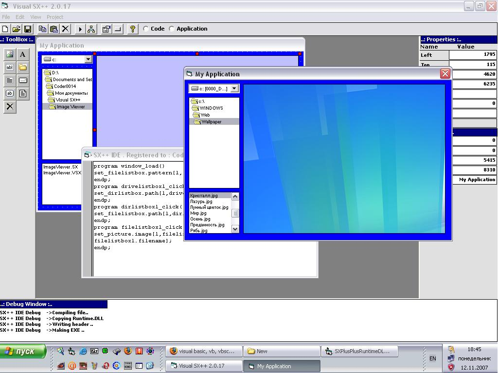



## Visual SX\+\+ Scripting language

### Description

Visual SX++ is a complete scripting language with IDE and compiler. It can handle variables , labels ,

[If] statements , For/Next loops and Do Until loops
 
### More Info
 

             |
---                |---
**Submitted On**   |2007-11-12 12:00:00
**By**             |[\[\[ Coder0014 \]\]](https://github.com/Planet-Source-Code/PSCIndex/blob/master/ByAuthor/coder0014.md)
**Level**          |Advanced
**User Rating**    |4.8 (24 globes from 5 users)
**Compatibility**  |VB 3\.0, VB 4\.0 \(16\-bit\), VB 4\.0 \(32\-bit\), VB 5\.0, VB 6\.0, VB Script, ASP \(Active Server Pages\) , VBA MS Access, VBA MS Excel
**Category**       |[Complete Applications](https://github.com/Planet-Source-Code/PSCIndex/blob/master/ByCategory/complete-applications__1-27.md)
**World**          |[Visual Basic](https://github.com/Planet-Source-Code/PSCIndex/blob/master/ByWorld/visual-basic.md)
**Archive File**   |[Visual\_SX\+20904811122007\.zip](https://github.com/Planet-Source-Code/coder0014-visual-sx-scripting-language__1-69598/archive/master.zip)

